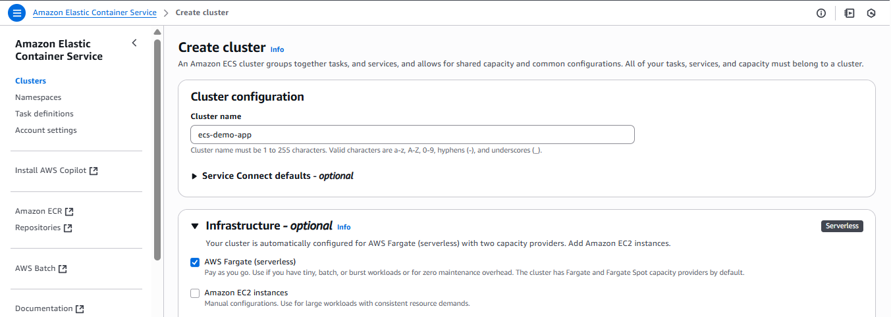

# ecs-eks-demo-app

### Spring initializr 

1. Open https://start.spring.io/
2. Add actuator and spring web dependecy and select option as below 

### Dockerfile Setup
Create Dockerfile

### Github Workflows
1. Create .github/workflows/ci.yml file
2. Add below secrets in github

    DOCKER_USERNAME: Your Docker Hub username
    DOCKER_PASSWORD: Your Docker Hub password or personal access token

### ECS 
1. Login aws console and select ECS
2. Click on Create Cluster
3. Provide cluster name and select AWS Fargate 

#### Create new task defination
1. image url: basivireddy/spring-boot-app:latest
2. container port: 8080 (spring boot default port)

#### Create new service

Create new Service

By default, ecs load balancer not accessble from internet so modify the Loadbalancer inbound rule to open trafic form internet.

